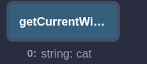

# Timed Voting System Using a Smart Contract
I used [Remix IDE](https://remix.ethereum.org/) for compiling and deployment.

I Also took some [notes](notes.md) for future reference.

After compiling, I deployed the smart contract, passed in the number of minutes allowed for voting, and the candidates.

The contract was deployed successfully, and started executing and the timer was started.

We can vote by entering the candidate index

Voted successfully

We can check the cadidate with the highest current votes :

But if we try to vote again from the same account, it doesn't work. Only one time is allowed for each account.

We can choose another account and vote, this works fine.

to know time left till the deadline we can use :

If we try to vote after the deadline was reached, it is not allowed 

That's for now, I will be adding new features later :D
